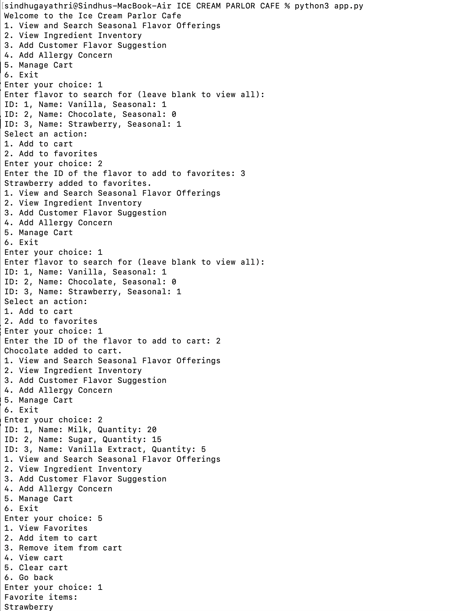
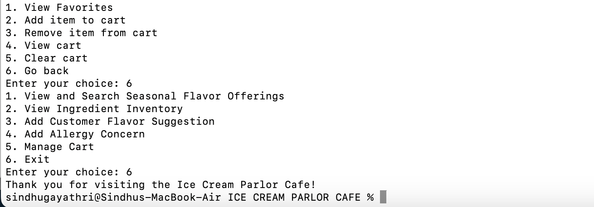

# ICE CREAM PARLOR CAFE APPLICATION

Welocome to Ice Cream Parlor Cafe command-line Application. This allows users to interact with seasonal flavor offerings, check ingredient inventory, add customer flavor suggestions, customer allergy concerns, and manage cart.

## Prerequisites

Make sure you have installed :
*python (version 3.x.x)
*SQLite

## Installation Steps:

1.Clone repository
->git clone <https://github.com/TunuguntlaSindhuGayathri/ICECREAM_PARLOR_CAFE.git>
->cd <repository-folder>

2.Setup the database
create a new SQLite database file named "icecream_parlor_cafe.db"
->sqlite3 icecream_parlor_cafe.db
(or)
to initialize the database schema and insert initial data(make sure you have the initialize_db.py file in the project directory)
->python3 initialize_db.py

3.Dependencies
If you are using mac no dependencies needed
For windows - make sure you have the requirements.txt file in the project directory which contains all necessary dependencies.
->pip install -r requirements.txt

## Running the Application

To start the application run the following command:
->python3 app.py("MacOS")
->python app.py("Windows")

## Notes

->View and Search Seasonal Flavor Offerings:
Search for specific flavors or view all available seasonal offerings.
->View Ingredient Inventory:
Check the current stock of ingredients.
->Add Customer Flavor Suggestion:
Submit new flavor suggestions.
->Add Allergy Concern:
Record allergy concerns for customer safety.
->Manage Cart:
Add items to the cart, view favorites, and manage cart items like clear cart, view cart, remove item from cart.

## Additional Information

->Database: The SQLite database (icecream_parlor_cafe.db) stores all application data.
->Files:
main.py: It imports and runs the main_menu function from the app module.
app.py: Main application script.
cart.py, database.py, models.py, utils.py: Modules for different aspects of the application (cart management, database operations, data models, utility functions).

## Documentation of test steps




## SQL Query or ORM abstraction Implementation

1.Create Tables and Insert Initial Data
2.Fetching Seasonal Flavor Offerings
3.Adding Customer Flavor Suggestion

## Docker File

1. **Clone the repository**

   ```sh
   git clone <https://github.com/TunuguntlaSindhuGayathri/ICECREAM_PARLOR_CAFE.git>
   cd ICECREAM_PARLOR_CAFE
   ```

2. **Create and activate a virtual environment**

   ```sh
   python -m venv venv
   source venv/bin/activate  # On Windows, use `venv\Scripts\activate`
   ```

3. **Install dependencies**

   ```sh
   pip install -r requirements.txt
   ```

4. **Initialize the database**

   ```sh
   python initialize_db.py
   ```

5. **Run the main application**

   ```sh
   python app.py
   ```
